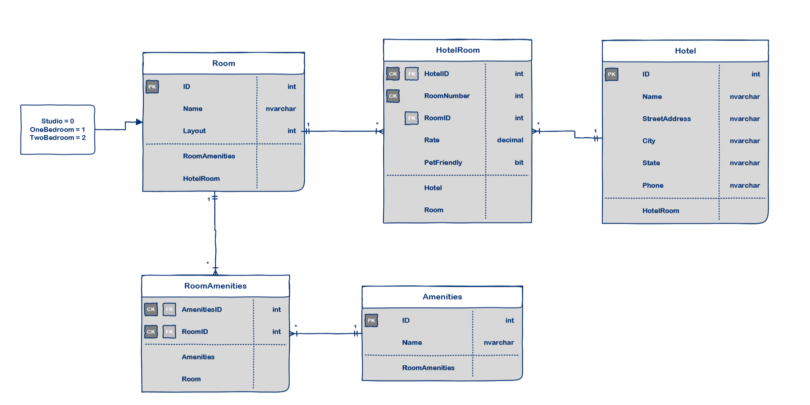

# Async Inn - MVC Project
*Author: Trevor Stubbs*

- Lab: 16 - DTOs
- Lab: 14 - Navigation Properties & Routing
- Lab: 13 - Dependency Injection
- Lab: 12 - Intro to EFCore & APIs
- Lab: 11 - Databases & ERDs


----

## Description
This app is to showcase building and deploying a RESTful API using a sql database. This is the form of a hotel managment system.

---

### Getting Started
Clone this repository to your local machine.

```
$ git clone https://github.com/TrevorStubbs/Async-Inn
```

### To run the program from Visual Studio:
Select ```File``` -> ```Open``` -> ```Project/Solution```

Next navigate to the location you cloned the Repository.

Double click on the ```AsyncInn``` directory.

Then select and open ```AsyncInn.sln```

Use `Install-Package Microsoft.EntityFrameworkCore.SqlServer` in the project manager console to install SQL server into the project

Use `Install-Package Microsoft.EntityFrameworkCore.Tools` in the project manager console to give you access to the database tools.

Use `Install-Package Microsoft.AspNetCore.Identity` in the project manager console to install the tools needed for user identification.

---

### Visuals
 <sub>Code Fellows Class D11</sub>

---

### Change Log
- 2.5: Create user Login and allow them to Login
- 2.4: Hotel DTO Finished
- 2.3: HotelRoom DTO Finished
- 2.2: Room DTO Finished
- 2.1: Amenity DTO finished
- 2.0: Summary Comments and README.md
- 1.9: RoomAmenites and HotelRoom Entity Join Tables built and linked
- 1.8: Room and Amenities Controllers Updated and tested
- 1.7: IAmenities and AmenitiesRepository Built
- 1.6: IRoom Interface and RoomRepository Built
- 1.5: HotelController updated with DI
- 1.4: IHotel Interface and HotelRepoistory built
- 1.3: Hotels, Rooms, Amenities controllers built and tested
- 1.2: AsyncInnDbContext built and DB migration started
- 1.1: Hotel, Room, Amenity Models built
- 1.0: Repo and README.md Built

---

### Diagram Draft
- 
- [ERD (pdf)](assets/[ERD]AsyncInnTrevorStubbs.pdf)
- [ERD Documentation (pdf)](assets/AsyncInnERDExplainedTrevorStubbs.pdf)

---

### Identity Description
- Identity.EntityFrameworkCore is a modular library that does all the user authorization and authentication within the .NetCore framework. 
- It employs some of the most up-to-date hashing, salting and cryptography for keeping user data secure. 
- Implementing it into a code base requires the DbContext file to inherit from IdentityDbContext.
    - IdentityDbContext needs implement a class so a new model must be built which inherits from IdentityUser class.
- A new controller should be built to handle the user creation and login process.

------------------------------
For more information on Markdown: https://www.markdownguide.org/cheat-sheet
